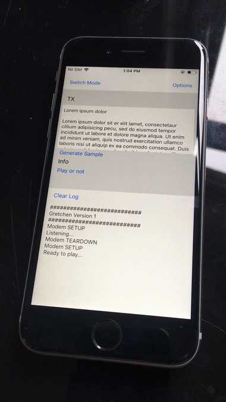

```
 _ _ _      ____          _       _                
| (_) |__  / ___|_ __ ___| |_ ___| |__   ___ _ __  
| | | '_ \| |  _| '__/ _ \ __/ __| '_ \ / _ \ '_ \ 
| | | |_) | |_| | | |  __/ || (__| | | |  __/ | | |
|_|_|_.__/ \____|_|  \___|\__\___|_| |_|\___|_| |_|
                                                   
```
An audio modem library and some shell programs written in C99. 
It utilizes the excellent liquid SDR library (https://github.com/jgaeddert/liquid-dsp/). 
Libgretchen intended to be the foundation for implementing one way **ad-hoc low bandwidth data channels** 
between arbitrary devices using the available audio hardware (speakers and microphones).

  
Gif shows the intended use case: a transmission from an iphone to a linux thinkpad. 
When the thinkpad is shown the message is replayed again by the iphone. 
The IOS shell code is not part of this repo, but instructions on how to build the lib for IOS (see below). 

### Note
The transmission of information over the air, in the audible spectrum, has its own set of challenges. 
Approaching this problem by utilizing SDR algorithms turned out to be interesting 
but not reliable enough to be usable for the intended use case. 
Therefore, this repo fulfills archival purposes and is not actively developed.
Feel free to fork, learn or do whatever with it.  

### Notes on coding style and expected bugs
* All c code has been compiled using gcc, clang and also cross compiled with clang for IOS (arm).
* Valgrind has been used extensively, so obvious memory leaks should be rare.
* The code is in a proof of concept stage, so
    * The code has no notion of threads whatsoever.  
    * Some option parameter combinations will result in crashing the modem. I did not invetigate these.
    * No unit tests. Just a few test programs (see the CMakeList.txt)
    * Incomplete error checking (e.g. no malloc checks...)
    * No hiding of internals 
    * The cmake build system is configured to produce a static library (and hence no install rule exists).

## Overview
The repo consists of a modem and a backend part named `gretchen` and `gretchen.backend`. 
The modem is split into a transmitting (TX) and a receiving (RX) part (see /libs/gretchen/include/gretchen.h). 
A quick overview of components and data flow: 
```
     input bytes                                 output bytes
          v                                           ^ 
   +------v-------------------------------------------^-------+
   |      v                 Gretchen                  ^       |
   |  ----------                                  ----------  |
   | | modem TX |                                | modem RX | |
   |  ----------                                  ----------  |
   |      v                                           ^       |
   +------v-------------------------------------------^-------+
          v                                           ^
     audio sample                                audio sample
          v                                           ^ 
   +------v-------------------------------------------^-------+
   |      v                  Backend                  ^       |
   |  ----------       OS Audio Subsystem         --------    |
   | | playback |       (e.g. portaudio)         | record |   |
   |  ----------                                  --------    |
   |      v                                           ^       |
   +------v-------------------------------------------^-------+
          v                                           ^
       speaker )    ) )) )    ) )) ))) ))) ) )   microphone
```
Input bytes are encoded by the TX part of the modem which outputs an audio sample. 
This sample is then played back via the OS audio subsystem. 
On the receiving side recorded audio samples are consumed by the RX part of the modem. 
If a frame can be decoded the callbacks of the RX modem are called and deliver the received bytes.

### Usage of the shell programs
After compiling, several binaries have been created in the `build` directory.  
(see CMakeList.txt in the root of the repo).  

* To transfer a file:   
`$ gret -o OPTIONFILE -f FILE`  
* And to (listen) receive a file:  
`$ gret -o OPTIONFILE`  

### Bash scripts for self-testing modem options
All bash scripts and option files (see below) are located in the `scripts` directory in the root of the repo.  
A self-test script encodes and decodes the data on the same machine, to allow quick testing of a modem options.

* only use the modem and pass samples via unix pipe from tx to rx:  
`sh selftest_pipe.sh OPTIONFILE INPUTFILE`  
* use the audio backend. NOTE: using an external speaker for testing in this mode can help:  
`sh selftest_gapped.sh OPTIONFILE INPUTFILE`   

### Shell programs the bash scripts are using
Libgretchen was developed and tested in small c programs, so that every aspect could be tested in 
a simple unix way. The four programs are: 

* `rec` for recording and passing the stream of raw samples to stdout. 
* `play` for playing back the stream of raw samples from stdin
* `enc` for encoding a byte stream from stdin and passing the output to stdout.
* `dec` for decoding a stream of raw audio samples and passing the decoded bytes (if any) to stdout.

To illustrate how the programs could be used:  

* encodes the inputfile and plays the resulting sample back.  
`$ cat INPUTFILE | enc $(cat OPTIONFILE) | play`   

* records and writes, if any frames can be decoded, 
the output to stdout:  
`$ rec | dec $(cat OPTIONFILE) > OUTPUTFILE`

* encoding and decoding in the same pipeline (like self_test_pipe.sh)  
`$ cat INPUTFILE | enc $(cat OPTIONFILE) | dec $(cat OPTIONFILE) > OUTPUTFILE`  

### Option Files
Option files describe the actual behavior of the modem. Here is an example 
(more are located in the `scripts` directory in the root of the repo).
```
--frmtype modem
--frmlen 300
--frmcrc crc32
--frmifec secded7264
--frmofec h84
--frmmod qpsk
--modshape arkaiser
--modsampsym 6
--modsymdelay 11
--modexcbandw 0.75
--modfreq 18200
--modgain 0.25
--flushlen 9
```
For a list of possible values consult `liquid.h`  
https://github.com/jgaeddert/liquid-dsp/blob/master/include/liquid.h  

## Compiling
To compile the following libraries and build systems are needed.  

* cmake           https://cmake.org  
* autoconf        https://www.gnu.org/software/autoconf/  
* portaudio       http://www.portaudio.com/  

#### Dependencies
* libfec          https://github.com/quiet/libfec
* liquid sdr      https://github.com/jgaeddert/liquid-dsp/  

### Compiling on linux 
Libgretchen has been compiled on arch and ubuntu, other linux distros or other flavors of unix have not been tested. 

#### libfec
```
$ ./configure  
$ make
$ make install (as sudo)
```
Now you can copy the libfec.a file and fec.h to `THISREPO/libs/external/libfec`.

#### liquid sdr
```
$ ./bootstrap (if repo is cloned)
$ ./configure
```
Next edit the generated `config.h` file and set 
`#define HAVE_FFTW3_H 0`  
`#define HAVE_LIBFFTW3F 0`  
to zero. To compile without fftw3. We won't need it.  
```
$ make 
```
Next copy the `libliquid.a` library file and the headerfiles `liquid.h` and `liquid.internal.h` into `THISREPO/libs/external/liquid/`.  

#### portaudio
The portaudio package is available in most distributions.  
If its not available, follow their instructions of how to install it system wide. 

#### libgretchen
After taking the above steps build by running the `runcmake.sh` file.


### Compiling on macOS (OSX)
The code has been successfully compiled with clang 10.0.0, other versions should work too. 

#### libfec
```
$ ./configure --build=x86_64-apple-darwin
$ make
$ make install (as sudo)
```
Now you can copy the libfec.a file and fec.h to `THISREPO/libs/external/libfec`.

#### liquid sdr
```
$ ./bootstrap (if repo is cloned)
$ ./configure
```
Next edit the generated `config.h` file and set 
`#define HAVE_FFTW3_H 0`  
`#define HAVE_LIBFFTW3F 0`  
to zero. To compile without fftw3. We won't need it.  
```
$ make 
```
Next copy the `libliquid.a` library file and the headerfiles `liquid.h` and `liquid.internal.h` into `libs/external/liquid/`.  

#### portaudio
Portaudio can be simply be installed system wide via homebrew `https://brew.sh`.  
```
$ brew install portaudio
```

#### libgretchen
After taking the above steps build by running the `runcmake.sh` file.


### Compiling for IOS on macOS
Since the liquid-sdr dependency uses autotools, we can use a modified configure script for
building. Get the `iconfigure` script from https://github.com/szanni/ios-autotools. 
A few modifications to the `iconfigure` script have to be done beforehand, to prevent linker errors:     
see: https://thomask.sdf.org/blog/2015/09/15/xcode-7s-new-linker-rules.html

* Change the script to use **clang** instead of **gcc** (line 90 to 93 variables CC, CPP and CXX).  
* Append CFLAGS with -fembed-bitcode-marker
* Append LDFLAGS with -fembed-bitcode  

#### liquid sdr
* put the `iconfigure` file in the directory of liquid-sdr.  
* then after bootstrapping invoke it with some predefinitions.
```
$ ./bootstrap (if repo is cloned)  
$ ac_cv_func_malloc_0_nonnull=yes ac_cv_func_realloc_0_nonnull=yes ./iconfigure arm64  
$ make  
```
After compiling put the generated .a file aside (or rename it), invoke `make clean` and  
repeat the process a second time, this time invoke `iconfigure` with `X86_64`.   

* Combine the compiled x86_64 and arm64 libs into a fat lib
using the `lipo` tool:  	
`$ lipo -create arm64/libliquid.a x86_64/libliquid.a -output ./fat/libliquid.a`  

#### Check if build library file is a fat lib
* to check use:  
`$ lipo -info libliquid.a`  
The output, if ok, is:  
`Architectures in the fat file: libliquid.a are: x86_64 arm64`  

* To check if bitcodes have been enabled:  
`$ otool -l libliquid.a | grep __LLVM`  
see: https://stackoverflow.com/questions/31486232  

#### libgretchen
* Create a new project in xcode
* Form the templates choose `Cocoa Touch Static Library`
* Add needed information; choose a location etc...
* remove the PROJECTNAME.swift file (not needed in this project)  
* Add source and header files from this repo to the project (Choose Add Files to ...).  
  in particular all source files from `libs/gretchen/src/modem/src`, `libs/gretchen/src/helper/src` and  
  the header files from `libs/gretchen/include`.    
* In the **Project Build Settings** append the   
  Header Search Paths: with a path to the headers `liquid.h` and `liquid.internal.h` of the compiled fat library.   
  Library Search Paths: with a path to the compiled fat library file `libliquid.a`.  
* In the **Target Build Phases**  
  add to `Link Binary With Libraries`: the fat library `libliquid.a`   
  add to `Copy Files`: the fat library headers `liquid.h` and `liquid.internal.h`  
* To get rid of strict prototype warnings  
  in **Target Build Settings** -> **Apple Clang - Warnings - All languages**  
  set the value of `Strict Prototypes` to No.  

It should compile without warnings. The result can now be included in any IOS swift xcode project 
and runs on hardware and the simulator (the reason for creating the fat library).


## Acknowledgments
While writing I learned a lot about 

* how to utilize liquid SDR for this special use case, by reading the code of libquiet (https://github.com/quiet/quiet), thank you!
* reading all the wonderful blogposts by random people on the net about C and other topics (unix!).
* about how nice C can be, if you code like an adult and take the time to understand things properly.

And i want to thank my friend Thomas Feldhaus for helping me in so many ways!
